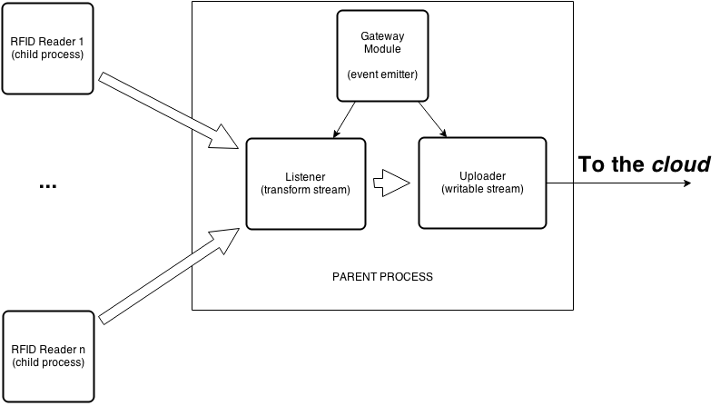

# Your Own RFID Gateway Written in Node.js 

In our [previous post](http://blog.innobec.com/?p=1056&lang=en) we talked about
a general architecture of an
[RFID](http://en.wikipedia.org/wiki/Radio-frequency_identification)-based asset
tracking system and, specifically, about an API server in the heart of such a
system. Now we are going to take a look at the remote nodes collecting the data
that comes from RFID readers and sending this data through some API to the
database. Let's create our proper RFID gateway server software with
[Node.js](http://nodejs.org/).

## Architecture

### Hardware

The hardware part didn't change a lot since the previous article, though our
diagram will be scoped on the peripherals now:

### Software

On the software side, our goal will be to leverage asynchronous design patterns
forming the basis of Node.js API:
[event emitters](http://nodejs.org/api/events.html) and
[streams](http://nodejs.org/api/stream.html).

Since we can (and most likely would in the real life) have multiple RFID
readers connected to the same gateway, we have to be able to consume data from
several reader modules independently. Moreover, these modules can correspond /
talk to the different types of hardware while reporting to the same gateway.
Finally, in order to unload the main process and take advantage of multi-
processor / core architectures we are putting those reader modules in separate
[child processes](http://nodejs.org/api/child_process.html). These processes
are [piping](http://nodejs.org/api/stream.html#stream_readable_pipe_destination_options)
the data to the `Listener` module of the parent process, which in its turn
analyses and transforms (if needed) the data and pipes it further to the
`Uploader` module. The latter is the one transmitting the results to the cloud
via HTTP or some other protocol.

## Implementation

We are assuming further that you already have Node.js and
[npm](https://www.npmjs.org/) installed and `node` / `npm` commands are
accessible. Let's create a new package for our RFID gateway by typing
`npm init` once we are in the target folder. After answering a few questions
(just use the defaults for now), we will have our `package.json` created.

Next, let's assume we have a file `config.json` containing some configuration
for our gateway in the root folder of our package. Then the entry point for
our application (`./index.js`) can look like this:

    'use strict';

    /**
     * Dependencies
     */
    var config = require('./config.json');
    var Gateway = require('./lib/gateway');

    module.exports = new Gateway(config);

Obviously, this is a bit simplyfied, and in real life we should always check
if the configuration file exists, etc., but here we will omit these
verifications for sake of simplicity. Also, at this point we don't even care
about the exact content of `config.json`, as long as it contains all the data
necessary to connect to our RFID readers (e.g. ports and reader types) and to
transmit the information to the cloud (e.g. endpoints, authentication
credentials, etc.).

### Gateway Module

Gateway module is the core of our gateway's master process. Architectured as
an event emitter, it handles the system signals, deployment-related events,
creation of scanning and uploading objects, etc. Here is how it looks like
(this code goes to `./lib/gateway.js`):

    'use strict';

    /**
     * Dependencies
     */
    var EventEmitter = require('events').EventEmitter;
    var util = require('util')
    var async = require('async');
    var _ = require('lodash');
    var Uploader = require('./uploader');
    var Listener = require('./listener');
    var defaults = require('./defaults.json');

    module.exports = Gateway;

    // Gateway module
    function Gateway(config) {
      if (!(this instanceof Gateway))
        return new Gateway(config);

      EventEmitter.call(this);

      // Configuration validation, defaults, etc.
      config = config || {};
      _.defaults(config, defaults);

      // Instantiate a listener and an uploader
      var uploader = new Uploader(config['uploader']);
      var listener = new Listener(config['listener']);

      // Deployment-related events: online message
      async.each([listener, uploader], function(stream, cb) {
        stream.on('error', function(err) {
          console.error(err);
          process.send('shutdown');
        });

        stream.on('ready', function() {
          cb();
        });
      }, function(err) {
        if (err) {
          console.error(err);      
          process.send('shutdown');
        }

        process.send('online');
      });

      // Deployment-related events: shutdown message
      process.on('message', function(message) {
        if (message === 'shutdown') {
          async.each([listener, uploader], function(stream, cb) {
            stream.emit('shutdown');

            stream.on('close', function() {
              cb();
            });
          }, function(err) {        
            process.exit((err) ? 1 : 0);
          });
        }
      });

      // Let's get it started
      listener.pipe(uploader);
    }

    util.inherits(Gateway, EventEmitter);
    
Some key sections of this constructor include:

- configuration validation (feel free to validate more thoroughly based on
your specific case), applying defaults;
- creation of `Listener` and `Uploader` instances;
- emitting `online` event once both listener and uploader are ready (this
is necessary in order to provide zero-downtime deployment, with
[Naught](https://github.com/andrewrk/naught), for example);
- listening for the `shutdown` message from our deployer in order to
gracefully close all the connections and stop the process.

Finally, thanks to stream-based architecture we used, starting it all
becomes as simple as piping our listener to our uploader:

    listener.pipe(uploader);

Now, let's take a closer look at the components responsible for reading
the data and transmitting it upstream.

### Listener

As we saw on the software architecture diagram, `Listener` module object
is a transform stream, which means it is writable and readable (and can
be piped from and to). Since the current version of Node.js streams (as
of v0.10, so called "streams2") operates on Strings and Buffers by
default, we need to put our `Listener` stream in the object mode if we
want it to emit generic JavaScript values. So, we have to call its
parent constructor like this:

    Transform.call(this, {objectMode: true});

Next, we need to fork child processes for different RFID readers
attached to our gateway (as listed in the configuration file). Using
`async` library, we make sure all the devices are activated (see
`attach` function) and then emit `ready` event on our `Listener`
object. The whole module we will have in `lib/listener.js` is listed
below:

    'use strict';

    /**
     * Dependencies
     */
    var Transform = require('stream').Transform;
    var util = require('util');
    var fork = require('child_process').fork;
    var async = require('async');
    var split2 = require('split2');

    module.exports = Listener;

    function Listener(config) {
      var that = this;

      config = config || {};
      config['devices'] = config['devices'] || [];

      Transform.call(this, {objectMode: true});

      async.each(config['devices'], function(deviceConfig, cb) {
        that.attach(deviceConfig, function(err) {  
          cb(err);
        });
      }, function(err) {
        if (err)
          return that.emit('error', err);

        that.emit('ready');
      });
    }

    util.inherits(Listener, Transform);

    Listener.prototype._transform = function(message, enc, next) {

      // We can do some preprocessing here

      this.push(message, enc);

      next();
    };

    Listener.prototype.attach = function(config, done) {
      var that = this;

      var device = fork(config.module, [], {
        silent: true
      });

      device.send({
        event: 'connect',
        config: config
      });

      device.on('message', function(message) {
        switch (message.event) {
          case 'ready':
            done();
            break;
          case 'error':
            that.emit('error', message.error);
            break;
          default:
            break;
        }
      });

      device.stdout.pipe(split2(JSON.parse)).pipe(this);
    };
    
Here, `attach` method receives a configuration object
containing all the information necessary to connect to the
reader and start scanning, including the `module` property,
which is a path to the reader driver module to be forked.
Note, that we are forking this child process with `silent`
option enabled. It means that `stdout` stream of this
process will be piped to `device.stdout`, which, in its
turn, we are piping to our very `Listener` stream through
another transform stream, `split2(JSON.parse)`. What the
latter does, it takes the chunks coming from this `stdout`
stream (which is not in the object mode, i.e. can be
sending fragmented output), assembles them into complete
lines and parses into JSON objects that are being pushed
further.

This processing procedure defines the following principles
that have to be used while architecturing reader modules:

- reader module has to print the scanning results as
stringified JSON objects, one per line, to its `stdout`;
- if an error occurres, the reader process should send a
message object with `event` property equal to `error` (this
message will be transmitted upstream to the gateway module).

Also, as you can notice, `_transform` function (necessary for
implementation of a transform stream) doesn't do a lot in our
case simply pushing further all the messages it receives, but
at the same time it could be used to do some preprocessing
(and/or error handling). For example, we could cache the
messages, analyze the new input and push it only in case of
some changes we are tracking.

### Uploader

Finally, after all these manipulations we have our data
flowing into the `Uploader` object, which is a writable
stream with the object mode enabled, which means it
receives JavaScript objects sent by the reader driver
modules. Since the implementation of a specific approach
to sending the data to remote servers falls beyond the
scope of this article, we will just log the incoming
messages to the console. The code below goes to
`./lib/uploader.js`:

    'use strict';

    /**
     * Dependencies
     */
    var Writable = require('stream').Writable;
    var util = require('util');

    module.exports = Uploader;

    function Uploader(config) {
      Writable.call(this, {objectMode: true});
    }

    util.inherits(Uploader, Writable);

    Uploader.prototype._write = function(message, enc, next) {
      console.info('Sending: ' + JSON.stringify(message));

      // Sending to the cloud here

      next();
    };

### Reader Modules

One of the most important subjects we haven't looked
into yet is the reader modules. The main reason is the
fact that any specific implementation of such a module
would rely heavily on the hardware being used. In other
words, since there is no standard approach to the way
RFID readers connect to gateways, every reader
manufacturer (or even devices from the same
manufacturer) requires its own reader module to be
written. We are planning to examine some examples of
such modules in greater depth in our future posts, but
for now let's just use the
[`mockout`](https://www.npmjs.org/package/mockout)
package to simulate messages from a reader module.

### Putting It All Together

There is a couple of last things we need to do before
we will be able to start our gateway.

First, we need an example config file. This will go to
`./config.json`:

    {
      "listener": {
        "devices": [
          {
            "path": "/some/path1",
            "module": "./node_modules/mockout"
          },
          {
            "path": "/some/path2",
            "module": "./node_modules/mockout"
          },
          {
            "path": "/some/path3",
            "module": "./node_modules/mockout"
          }
        ]
      },
      "uploader": {
      }
    }
    
Also, let's put default configuration values in
`./config/defaults.json`:

    {
      "listener": {
        "devices": []
      },
      "uploader": {}
    }
    
Finally, we have to install the packages used in
the implementation of our RFID gateway:

    npm install --save async@0.9.0 lodash@2.4.1 mockout@0.0.2 split2@0.1.2
    
This will also add listed packages to the dependencies
section of our `./package.json` file.

And that is it. If we run `node index.js` now,
we will see some output similar to the following:

    Sending: {"sortOf":"anObject","initializedWith":{"event":"connect","config":{"path":"tmr:///dev/ttyACM2","module":"./node_modules/mockout"}}}
    Sending: {"sortOf":"anObject","initializedWith":{"event":"connect","config":{"path":"tmr:///dev/ttyACM1","module":"./node_modules/mockout"}}}
    Sending: {"sortOf":"anObject","initializedWith":{"event":"connect","config":{"path":"tmr:///dev/ttyACM3","module":"./node_modules/mockout"}}}
    Sending: {"sortOf":"anObject","initializedWith":{"event":"connect","config":{"path":"tmr:///dev/ttyACM2","module":"./node_modules/mockout"}}}
    Sending: {"sortOf":"anObject","initializedWith":{"event":"connect","config":{"path":"tmr:///dev/ttyACM1","module":"./node_modules/mockout"}}}
    Sending: {"sortOf":"anObject","initializedWith":{"event":"connect","config":{"path":"tmr:///dev/ttyACM3","module":"./node_modules/mockout"}}}
    ...

This means that we have three child processes piping
the data from RFID readers through our `Listener` to
the `Uploader`, which is ready to send it wherever
we want.

## Next Steps

So, does this implementation cover completely the
software for peripheral nodes of our RFID system?
Or course, no. It provides a robust way to
organize the flow of data from the hardware to the
point when it's ready to be sent to remote servers
(which is pretty powerful result for only about two
hundred lines of code), but specific implementation
of reader modules (for different RFID manufacturers)
and uploading procedures (which, for example, can
use special protocols like MQTT or CoAP) worth a
closer look and can be a topic of our further
articles.

## License

[The MIT License](http://opensource.org/licenses/MIT)

Copyright (c) 2014 [Innobec Technologies Inc.](http://www.innobec.com/)